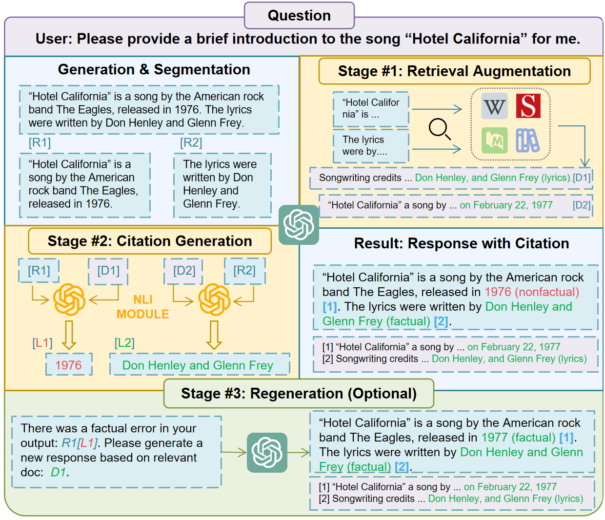
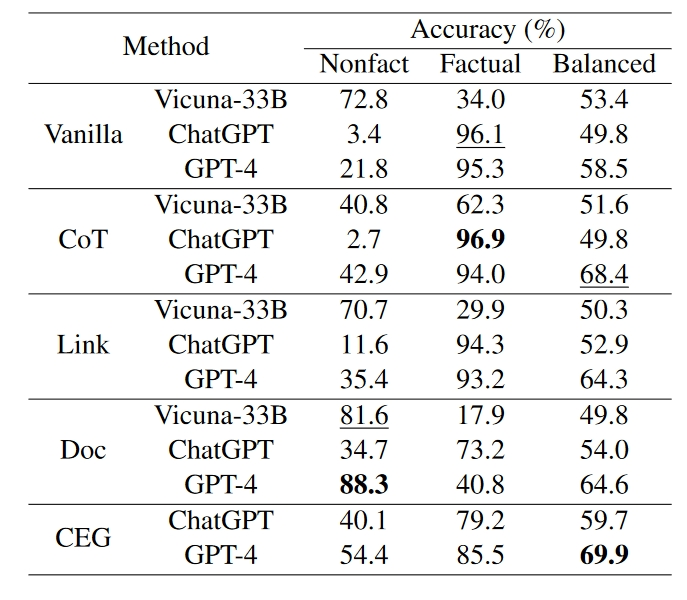
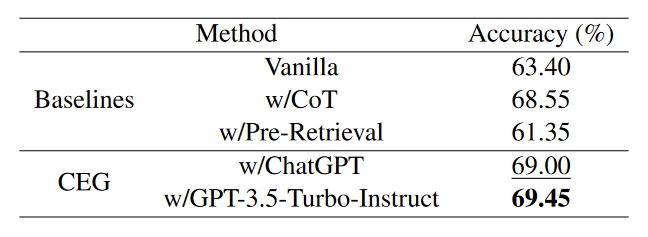
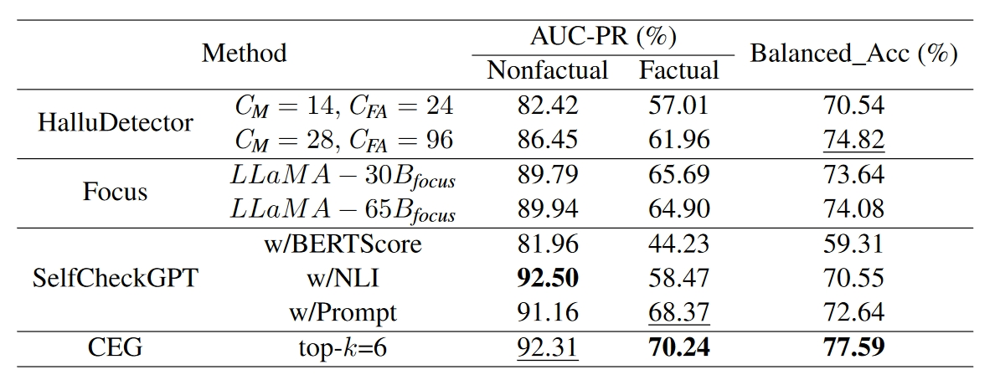

# Citation-Enhanced Generation for LLM-based Chatbots

  

## Introduction

This repository provides the implementation of our paper:  
**Citation-Enhanced Generation for LLM-based Chatbots**  
**Authors:** [Weitao Li, Junkai Li, Weizhi Ma, Yang Liu]  
Published in [ACL 2024 Main]

[Paper Link](https://arxiv.org/abs/2402.16063)

### Abstract

Large language models (LLMs) exhibit powerful general intelligence across diverse scenarios, including their integration into chatbots. However, a vital challenge of LLM-based chatbots is that they may produce hallucinated content in responses, which significantly limits their applicability. Various efforts have been made to alleviate hallucination, such as retrieval augmented generation and reinforcement learning with human feedback, but most of them require additional training and data annotation. In this paper, we propose a novel post-hoc **C**itation-**E**nhanced **G**eneration (**CEG**) approach combined with retrieval argumentation. Unlike previous studies that focus on preventing hallucinations during generation, our method addresses this issue in a post-hoc way. It incorporates a retrieval module to search for supporting documents relevant to the generated content, and employs a natural language inference-based citation generation module. Once the statements in the generated content lack of reference, our model can regenerate responses until all statements are supported by citations. Note that our method is a training-free plug-and-play plugin that is capable of various LLMs. Experiments on various hallucination-related datasets show our framework outperforms state-of-the-art methods in both hallucination detection and response regeneration on three benchmarks.

## Installation

To set up the environment, run:

```bash
pip install -r requirements.txt
```

Ensure you have the required dependencies installed.

## Usage

### Data Preparation

We put the processed main datasets in the `datasets` folder.

### Running the Model

Evaluate Our Method Using this Command:

```bash
bash eval.sh 
```

## Experiments

We conduct experiments on multiple hallucination detection datasets, comparing **CEG** with several SoTA baselines. The main contributions of our work can be summarized as follows:
- We are the first to propose the use of citation to alleviate hallucination in a post-hoc way with regeneration.
- We design a novel post-hoc citation-enhanced generation framework combined with retrieval augmentation and NLI to avoid hallucinations, which is flexible for existing LLMs.
- Experimental results show that our CEG framework achieves the best performance on three hallucination-related benchmarks.

## Results

### FELM Results


### Halueval Results


### Wikibio Results


The specific model versions used can be seen in the paper. Please note that the GPT series models at that time differ significantly from the current ones. **To obtain updated results, please rerun the experiments**.

## Citation

If you use this code, please cite:

```
@article{li2024citation,
  title={Citation-Enhanced Generation for LLM-based Chatbots},
  author={Li, Weitao and Li, Junkai and Ma, Weizhi and Liu, Yang},
  journal={arXiv preprint arXiv:2402.16063},
  year={2024}
}
```

## License

This project is licensed under the MIT License - see the LICENSE file for details.

